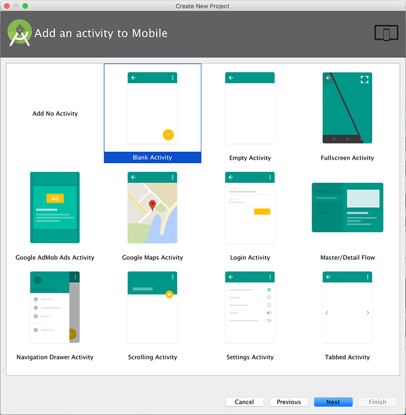
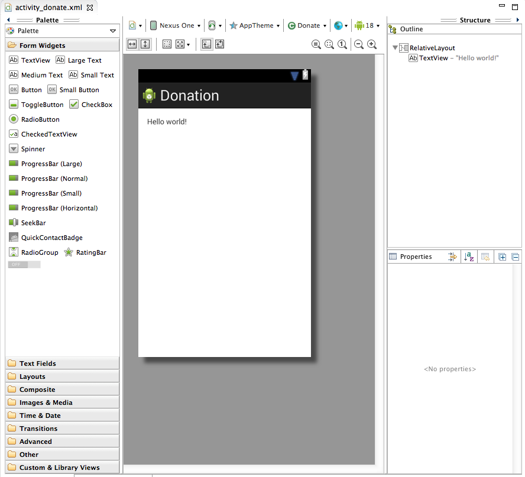

#Step 01 - Create Project

Create a new Android application, as demonstrated in the following 5 screenshots:

With the activity_donate open in the visual designer:

It is important to become familiar with the structure and purpose of the three panes surrounding the Donation 'canvas':

##Pallette:

##Outline

##Properties

These views are closely related - and you will need to monitor the information displayed there continually as you evolve the appearance of your activities screens.

