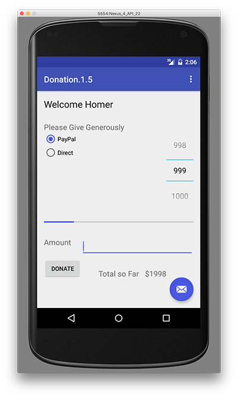
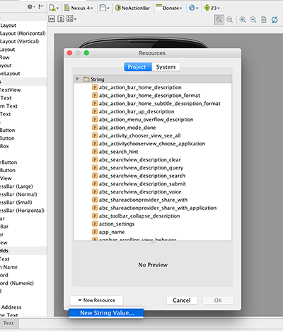
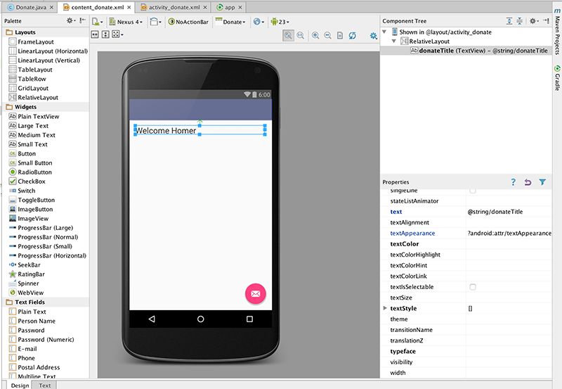

#Step 02 - Layout Donation Activity

For this lab, our objective is to produce an Android App that looks something like this:

In your <b>content_donate.xml</b>, delete the current 'Hello World' text, and drag and drop a new 'LargeText' form widget onto the canvas, and 'stretch' the widget to fill the canvas (like below). Look closely at the following:

Now, Double-Click the widget and you will be presented with the following:

Select the elipse (on the right hand side, indicated below)

and you will be presented with the Resources Menu

Select a 'New Resource->New String Value, and fill in the values as below

Double-Click the widget again and enter <b>donteTitle</b> for the <b>id</b> and hit return. 

Once completed, you'll have something like this

Note carefully the following features:

- the guides tyeing the text to the left, top and right corner
- in Outline - the name of the control has been changed from a default to 'donateTitle'.
- in Properties - check the value for 'text' and notice we entered 'Welcome Homer' into the text field

Recreate the above precisely.

A 'Lint warning' will have popped up in the top right:

Click on this:

.. and select 'Fix' - this is inviting us to give a name to the string, which will be stored in a separate 'string.xml' file. Give it the name 'donateTitle':

Save everything - and the lint warning should (eventually) disappear.

Locate the following two files and inspect them closely:

##res/layout/activity_dontate.xml
~~~xml
<RelativeLayout xmlns:android="http://schemas.android.com/apk/res/android"
    xmlns:tools="http://schemas.android.com/tools"
    android:layout_width="match_parent"
    android:layout_height="match_parent"
    android:paddingBottom="@dimen/activity_vertical_margin"
    android:paddingLeft="@dimen/activity_horizontal_margin"
    android:paddingRight="@dimen/activity_horizontal_margin"
    android:paddingTop="@dimen/activity_vertical_margin"
    tools:context=".Donate" >

    <TextView
        android:id="@+id/donateTitle"
        android:layout_width="wrap_content"
        android:layout_height="wrap_content"
        android:layout_alignParentLeft="true"
        android:layout_alignParentRight="true"
        android:layout_alignParentTop="true"
        android:text="@string/donateTitle"
        android:textAppearance="?android:attr/textAppearanceLarge" />

</RelativeLayout>
~~~

##res/values/strings.xml
~~~xml
<?xml version="1.0" encoding="utf-8"?>
<resources>

    <string name="app_name">Donation</string>
    <string name="action_settings">Settings</string>
    <string name="hello_world">Hello world!</string>
    <string name="donateTitle">Welcome Homer</string>

</resources>

~~~

Note the relationship between 'donateTitle' in both files. Also note we have a superfluous 'hello_world' string left over from the generated app. We can delete this now.

Bring in the following string into the donate activity now - (medium text) - and follow the same procedure as above. The designer should look like this:

and our XML files will look like this:

~~~xml
<RelativeLayout xmlns:android="http://schemas.android.com/apk/res/android"
    xmlns:tools="http://schemas.android.com/tools"
    android:layout_width="match_parent"
    android:layout_height="match_parent"
    android:paddingBottom="@dimen/activity_vertical_margin"
    android:paddingLeft="@dimen/activity_horizontal_margin"
    android:paddingRight="@dimen/activity_horizontal_margin"
    android:paddingTop="@dimen/activity_vertical_margin"
    tools:context=".Donate" >

    <TextView
        android:id="@+id/donateTitle"
        android:layout_width="wrap_content"
        android:layout_height="wrap_content"
        android:layout_alignParentLeft="true"
        android:layout_alignParentRight="true"
        android:layout_alignParentTop="true"
        android:text="@string/donateTitle"
        android:textAppearance="?android:attr/textAppearanceLarge" />

    <TextView
        android:id="@+id/donateSubtitle"
        android:layout_width="wrap_content"
        android:layout_height="wrap_content"
        android:layout_alignParentLeft="true"
        android:layout_alignParentRight="true"
        android:layout_below="@+id/donateTitle"
        android:text="@string/donateSubtitle"
        android:textAppearance="?android:attr/textAppearanceMedium" />

</RelativeLayout>
~~~
Our 'strings.xml' file....
~~~xml
<?xml version="1.0" encoding="utf-8"?>
<resources>

    <string name="app_name">Donation</string>
    <string name="action_settings">Settings</string>
    <string name="donateTitle">Welcome Homer</string>
    <string name="donateSubtitle">Please give generously</string>

</resources>
~~~

