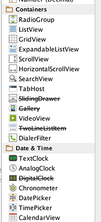

#Step 05 - New Control Layout

Recall the UI we are trying to implement:

We need radio buttons, some sort of selection/combo box + a progress bar. These can be found in various locations in the pallette:

RadioGroup, ProgressBar and NumberPicker seem likely candidates. The names of these controls are exactly as advertised, and we can expect them to be in the 'widgets' package. To verify this, try importing them at the top of the Donate activity class:

~~~java
import android.widget.RadioGroup;
import android.widget.NumberPicker;
import android.widget.ProgressBar;
~~~

... and we can bring in three fields into the class:

~~~java
  private RadioGroup   paymentMethod;
  private ProgressBar  progressBar;
  private NumberPicker amountPicker;
~~~

We can also open up three pages of documentation - which we can reverse engineer from the package/class names:

- <http://developer.android.com/reference/android/widget/RadioGroup.html>
- <http://developer.android.com/reference/android/widget/ProgressBar.html>
- <http://developer.android.com/reference/android/widget/NumberPicker.html>

Note this time we have gone to the Activity class before actually creating the controls. We should do this now - and remember to use the same names (for the IDs) as we create the controls.

Getting the layout +id names as shown above may take some practice. However, it is an essential skill to get on top of, even it it takes a lot of trial and error.

For reference purposes (try to do it yourself first!), these are the relevant generated xml files:

~~~xml
<?xml version="1.0" encoding="utf-8"?>
<RelativeLayout xmlns:android="http://schemas.android.com/apk/res/android"
    xmlns:tools="http://schemas.android.com/tools"
    xmlns:app="http://schemas.android.com/apk/res-auto" android:layout_width="match_parent"
    android:layout_height="match_parent" android:paddingLeft="@dimen/activity_horizontal_margin"
    android:paddingRight="@dimen/activity_horizontal_margin"
    android:paddingTop="@dimen/activity_vertical_margin"
    android:paddingBottom="@dimen/activity_vertical_margin"
    app:layout_behavior="@string/appbar_scrolling_view_behavior"
    tools:showIn="@layout/activity_donate" tools:context=".Donate">

    <TextView
        android:layout_width="wrap_content"
        android:layout_height="wrap_content"
        android:textAppearance="?android:attr/textAppearanceLarge"
        android:text="@string/donateTitle"
        android:id="@+id/donateTitle"
        android:layout_alignParentTop="true"
        android:layout_alignParentStart="true"
        android:layout_alignParentEnd="true" />

    <TextView
        android:layout_width="wrap_content"
        android:layout_height="wrap_content"
        android:textAppearance="?android:attr/textAppearanceMedium"
        android:text="@string/donateSubtitle"
        android:id="@+id/donateSubtitle"
        android:layout_below="@+id/donateTitle"
        android:layout_alignParentStart="true"
        android:layout_marginTop="27dp"
        android:layout_alignEnd="@+id/donateTitle" />

    <Button
        android:layout_width="wrap_content"
        android:layout_height="wrap_content"
        android:text="@string/donateButton"
        android:id="@+id/donateButton"
        android:layout_alignParentBottom="true"
        android:layout_centerHorizontal="true"
        android:layout_marginBottom="47dp"
        android:onClick="donateButtonPressed"/>

    <RadioGroup
        android:layout_width="match_parent"
        android:layout_height="match_parent"
        android:layout_below="@+id/donateSubtitle"
        android:layout_alignParentStart="true"
        android:id="@+id/paymentMethod"
        android:layout_toStartOf="@+id/amountPicker"
        android:layout_above="@+id/progressBar">

        <RadioButton
            android:layout_width="wrap_content"
            android:layout_height="wrap_content"
            android:text="@string/paypal"
            android:id="@+id/PayPal"
            android:checked="false" />

        <RadioButton
            android:layout_width="wrap_content"
            android:layout_height="wrap_content"
            android:text="@string/direct"
            android:id="@+id/Direct"
            android:checked="false" />
    </RadioGroup>

    <NumberPicker
        android:layout_width="wrap_content"
        android:layout_height="wrap_content"
        android:id="@+id/amountPicker"
        android:layout_alignTop="@+id/paymentGroup"
        android:layout_alignEnd="@+id/donateSubtitle" />

    <ProgressBar
        android:layout_width="wrap_content"
        android:layout_height="wrap_content"
        style="?android:attr/progressBarStyleHorizontal"
        android:id="@+id/progressBar"
        android:layout_alignParentStart="true"
        android:layout_alignEnd="@+id/donateSubtitle"
        android:layout_above="@+id/donateButton"
        android:indeterminate="false" />
</RelativeLayout>

~~~

~~~xml
<resources>
    <string name="app_name">Donation.1.0</string>
    <string name="action_settings">Settings</string>
    <string name="donateTitle">Welcome Homer</string>
    <string name="donateSubtitle">Please Give Generously</string>
    <string name="donateButton">Donate</string>
    <string name="paypal">PayPal</string>
    <string name="direct">Direct</string>
</resources>
~~~

If we have our naming conventions right - then we can bind to these new controls in onCreate:

~~~java
    paymentMethod = (RadioGroup)   findViewById(R.id.paymentMethod);
    progressBar   = (ProgressBar)  findViewById(R.id.progressBar);
    amountPicker  = (NumberPicker) findViewById(R.id.amountPicker);
~~~

This is the complete Donate class:

~~~java
package com.example.donation;

import android.os.Bundle;
import android.app.Activity;
import android.util.Log;
import android.view.Menu;
import android.view.View;
import android.widget.Button;
import android.widget.RadioGroup;
import android.widget.NumberPicker;
import android.widget.ProgressBar;

public class Donate extends Activity
{
  private Button       donateButton;
  private RadioGroup   paymentMethod;
  private ProgressBar  progressBar;
  private NumberPicker amountPicker;
  
  @Override
  protected void onCreate(Bundle savedInstanceState)
  {
    super.onCreate(savedInstanceState);
    setContentView(R.layout.activity_donate);
    
    donateButton  = (Button)       findViewById(R.id.donateButton);
    paymentMethod = (RadioGroup)   findViewById(R.id.paymentMethod);
    progressBar   = (ProgressBar)  findViewById(R.id.progressBar);
    amountPicker  = (NumberPicker) findViewById(R.id.amountPicker);
    
    amountPicker.setMinValue(0);
    amountPicker.setMaxValue(1000);
  }

  @Override
  public boolean onCreateOptionsMenu(Menu menu)
  {
    getMenuInflater().inflate(R.menu.donate, menu);
    return true;
  }
  
  public void donateButtonPressed (View view) 
  {
    Log.v("Donate", "Donate Pressed!");
   }
}
~~~

