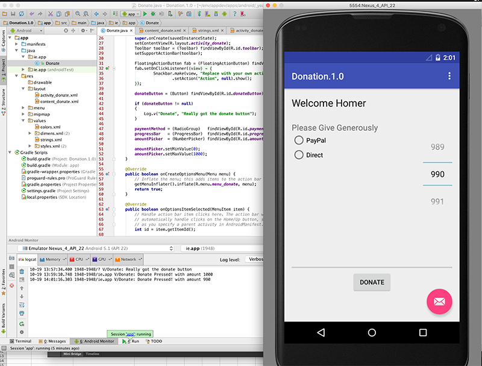

#Step 06 - NumberPicker

This is our reference documentation:

- <http://developer.android.com/reference/android/widget/NumberPicker.html>

which is a little overwhelming. Back in the guides:

- <http://developer.android.com/guide/components/index.html>

we might find some useful tutorial type introduction to this control - under 'User Interface' - 'Input Controls'

- <http://developer.android.com/guide/topics/ui/controls.html>

.. and this is the page on 'pickers'

- <http://developer.android.com/guide/topics/ui/controls/pickers.html>

This documentation is concerned with Fragments - a concept that may be difficult to grasp initially, and also explores the usage of date and time pickers. 

We can get up and running without this much fuss. Returning to the documentation, these three methods should be sufficient initially:

- <http://developer.android.com/reference/android/widget/NumberPicker.html#setMaxValue(int)>
- <http://developer.android.com/reference/android/widget/NumberPicker.html#setMinValue(int)>
- <http://developer.android.com/reference/android/widget/NumberPicker.html#getValue()>

In onCreate, initialise the values: 

~~~java
    amountPicker.setMinValue(0);
    amountPicker.setMaxValue(1000);
~~~

And in donateButtonPressed:

~~~java
  public void donateButtonPressed (View view) 
  {
    int amount = amountPicker.getValue();
    Log.v("Donate", "Donate Pressed! with amount " + amount);
   }
~~~

Run this now - and verify that it operates as expected (see the actual amounts in the log file, as below).

