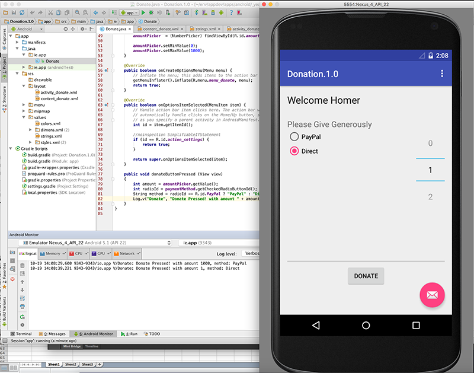

#Step 07 - The Radio Buttons

In <i>donateButtonPressed()</i> we need to discover which payment method has been selected. Our RadioGroup documentation is here:

- <http://developer.android.com/reference/android/widget/RadioGroup.html>

This looks like the method we need:

- [getCheckedRadioButtonId()](http://developer.android.com/reference/android/widget/RadioGroup.html#getCheckedRadioButtonId())

This is a revised version of <i>donateButtonPressed()</i>

~~~java
  public void donateButtonPressed (View view) 
  {
    int amount = amountPicker.getValue();
    int radioId = paymentMethod.getCheckedRadioButtonId();
    String method = "";
    if (radioId == R.id.PayPal)
    {
      method = "PayPal";
    }
    else
    {
      method = "Direct";
    }
    Log.v("Donate", "Donate Pressed! with amount " + amount + ", method: " + method);
   }
~~~

Run it now and verify we are getting the correct logs.

We can simplify it somewhat by reducing the if statement to a single line:

~~~java
    String method = radioId == R.id.PayPal ? "PayPal" : "Direct";
~~~

This is the Java ternary operator:

- <http://marxsoftware.blogspot.ie/2010/09/how-i-learned-to-stop-worrying-and-love.html>

This is the complete activity class so far:

~~~java
package ie.app;

import android.os.Bundle;
import android.support.design.widget.FloatingActionButton;
import android.support.design.widget.Snackbar;
import android.support.v7.app.AppCompatActivity;
import android.support.v7.widget.Toolbar;
import android.util.Log;
import android.view.View;
import android.view.Menu;
import android.view.MenuItem;
import android.widget.Button;
import android.widget.NumberPicker;
import android.widget.ProgressBar;
import android.widget.RadioGroup;

public class Donate extends AppCompatActivity {

    private Button          donateButton;
    private RadioGroup      paymentMethod;
    private ProgressBar     progressBar;
    private NumberPicker    amountPicker;

    @Override
    protected void onCreate(Bundle savedInstanceState) {
        super.onCreate(savedInstanceState);
        setContentView(R.layout.activity_donate);
        Toolbar toolbar = (Toolbar) findViewById(R.id.toolbar);
        setSupportActionBar(toolbar);

        FloatingActionButton fab = (FloatingActionButton) findViewById(R.id.fab);
        fab.setOnClickListener(new View.OnClickListener() {
            @Override
            public void onClick(View view) {
                Snackbar.make(view, "Replace with your own action", Snackbar.LENGTH_LONG)
                        .setAction("Action", null).show();
            }
        });

        donateButton = (Button) findViewById(R.id.donateButton);

        if (donateButton != null)
        {
            Log.v("Donate", "Really got the donate button");
        }

        paymentMethod = (RadioGroup)   findViewById(R.id.paymentMethod);
        progressBar   = (ProgressBar)  findViewById(R.id.progressBar);
        amountPicker  = (NumberPicker) findViewById(R.id.amountPicker);

        amountPicker.setMinValue(0);
        amountPicker.setMaxValue(1000);
    }

    @Override
    public boolean onCreateOptionsMenu(Menu menu) {
        // Inflate the menu; this adds items to the action bar if it is present.
        getMenuInflater().inflate(R.menu.menu_donate, menu);
        return true;
    }

    @Override
    public boolean onOptionsItemSelected(MenuItem item) {
        // Handle action bar item clicks here. The action bar will
        // automatically handle clicks on the Home/Up button, so long
        // as you specify a parent activity in AndroidManifest.xml.
        int id = item.getItemId();

        //noinspection SimplifiableIfStatement
        if (id == R.id.action_settings) {
            return true;
        }

        return super.onOptionsItemSelected(item);
    }

    public void donateButtonPressed (View view)
    {
        int amount = amountPicker.getValue();
        int radioId = paymentMethod.getCheckedRadioButtonId();
        String method = radioId == R.id.PayPal ? "PayPal" : "Direct";
        Log.v("Donate", "Donate Pressed! with amount " + amount + ", method: " + method);
    }
}

~~~

So run your app again just to confirm the logCat entries

