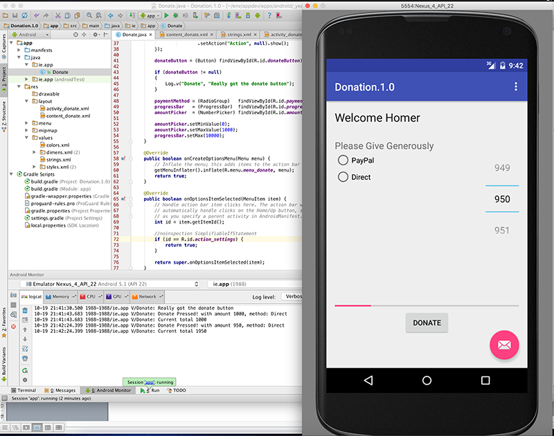

#Step 08 - The Progress Bar

The progress bar documentation:

- <http://developer.android.com/reference/android/widget/ProgressBar.html>

offers us advice on using the progress bar in multi-threaded application. Not quite what we are ready for yet! (but file it away for future reference).

These two methods are probably what we need:

- <http://developer.android.com/reference/android/widget/ProgressBar.html#setMax(int)>
- <http://developer.android.com/reference/android/widget/ProgressBar.html#setProgress(int)>

First we would need to equip our activity with the ability to remember the donation amounts:

~~~java
  private int totalDonated = 0;
~~~

Lets set max progress bar to 10000 in onCreate:

~~~java
    progressBar.setMax(10000);
~~~

.. and set the progress in donateButtonPressed:

~~~java
    totalDonated = totalDonated + amount;
    progressBar.setProgress(totalDonated);
    
    Log.v("Donate", "Donate Pressed! with amount " + amount + ", method: " + method);
    Log.v("Donate", "Current total " + totalDonated);
~~~

Try this now and observe the progress bar and logCat

This is the complete class so far:

~~~java
package ie.app;

import android.os.Bundle;
import android.support.design.widget.FloatingActionButton;
import android.support.design.widget.Snackbar;
import android.support.v7.app.AppCompatActivity;
import android.support.v7.widget.Toolbar;
import android.util.Log;
import android.view.View;
import android.view.Menu;
import android.view.MenuItem;
import android.widget.Button;
import android.widget.NumberPicker;
import android.widget.ProgressBar;
import android.widget.RadioGroup;

public class Donate extends AppCompatActivity {

    private Button          donateButton;
    private RadioGroup      paymentMethod;
    private ProgressBar     progressBar;
    private NumberPicker    amountPicker;
    
    private int             totalDonated = 0;

    @Override
    protected void onCreate(Bundle savedInstanceState) {
        super.onCreate(savedInstanceState);
        setContentView(R.layout.activity_donate);
        Toolbar toolbar = (Toolbar) findViewById(R.id.toolbar);
        setSupportActionBar(toolbar);

        FloatingActionButton fab = (FloatingActionButton) findViewById(R.id.fab);
        fab.setOnClickListener(new View.OnClickListener() {
            @Override
            public void onClick(View view) {
                Snackbar.make(view, "Replace with your own action", Snackbar.LENGTH_LONG)
                        .setAction("Action", null).show();
            }
        });

        donateButton = (Button) findViewById(R.id.donateButton);

        if (donateButton != null)
        {
            Log.v("Donate", "Really got the donate button");
        }

        paymentMethod = (RadioGroup)   findViewById(R.id.paymentMethod);
        progressBar   = (ProgressBar)  findViewById(R.id.progressBar);
        amountPicker  = (NumberPicker) findViewById(R.id.amountPicker);

        amountPicker.setMinValue(0);
        amountPicker.setMaxValue(1000);
        progressBar.setMax(10000);
    }

    @Override
    public boolean onCreateOptionsMenu(Menu menu) {
        // Inflate the menu; this adds items to the action bar if it is present.
        getMenuInflater().inflate(R.menu.menu_donate, menu);
        return true;
    }

    @Override
    public boolean onOptionsItemSelected(MenuItem item) {
        // Handle action bar item clicks here. The action bar will
        // automatically handle clicks on the Home/Up button, so long
        // as you specify a parent activity in AndroidManifest.xml.
        int id = item.getItemId();

        //noinspection SimplifiableIfStatement
        if (id == R.id.action_settings) {
            return true;
        }

        return super.onOptionsItemSelected(item);
    }

    public void donateButtonPressed (View view)
    {
        int amount = amountPicker.getValue();
        int radioId = paymentMethod.getCheckedRadioButtonId();
        String method = radioId == R.id.PayPal ? "PayPal" : "Direct";

        totalDonated = totalDonated + amount;
        progressBar.setProgress(totalDonated);

        Log.v("Donate", "Donate Pressed! with amount " + amount + ", method: " + method);
        Log.v("Donate", "Current total " + totalDonated);
    }
}

~~~

Here is another version of exactly the same class:

~~~java
package ie.app;

import android.os.Bundle;
import android.support.design.widget.FloatingActionButton;
import android.support.design.widget.Snackbar;
import android.support.v7.app.AppCompatActivity;
import android.support.v7.widget.Toolbar;
import android.util.Log;
import android.view.View;
import android.view.Menu;
import android.view.MenuItem;
import android.widget.Button;
import android.widget.NumberPicker;
import android.widget.ProgressBar;
import android.widget.RadioGroup;

public class Donate extends AppCompatActivity {

    private Button          donateButton;
    private RadioGroup      paymentMethod;
    private ProgressBar     progressBar;
    private NumberPicker    amountPicker;

    private int             totalDonated = 0;

    @Override
    protected void onCreate(Bundle savedInstanceState) {
        super.onCreate(savedInstanceState);
        setContentView(R.layout.activity_donate);
        Toolbar toolbar = (Toolbar) findViewById(R.id.toolbar);
        setSupportActionBar(toolbar);

        FloatingActionButton fab = (FloatingActionButton) findViewById(R.id.fab);
        fab.setOnClickListener(new View.OnClickListener() {
            @Override
            public void onClick(View view) {
                Snackbar.make(view, "Replace with your own action", Snackbar.LENGTH_LONG)
                        .setAction("Action", null).show();
            }
        });

        donateButton = (Button) findViewById(R.id.donateButton);

        if (donateButton != null)
        {
            Log.v("Donate", "Really got the donate button");
        }

        paymentMethod = (RadioGroup)   findViewById(R.id.paymentMethod);
        progressBar   = (ProgressBar)  findViewById(R.id.progressBar);
        amountPicker  = (NumberPicker) findViewById(R.id.amountPicker);

        amountPicker.setMinValue(0);
        amountPicker.setMaxValue(1000);
        progressBar.setMax(10000);
    }

    @Override
    public boolean onCreateOptionsMenu(Menu menu) {
        // Inflate the menu; this adds items to the action bar if it is present.
        getMenuInflater().inflate(R.menu.menu_donate, menu);
        return true;
    }

    @Override
    public boolean onOptionsItemSelected(MenuItem item) {
        // Handle action bar item clicks here. The action bar will
        // automatically handle clicks on the Home/Up button, so long
        // as you specify a parent activity in AndroidManifest.xml.
        int id = item.getItemId();

        //noinspection SimplifiableIfStatement
        if (id == R.id.action_settings) {
            return true;
        }

        return super.onOptionsItemSelected(item);
    }

    public void donateButtonPressed (View view)
    {
    totalDonated  = totalDonated + amountPicker.getValue();
    String method = paymentMethod.getCheckedRadioButtonId() == R.id.PayPal ? "PayPal" : "Direct";
    progressBar.setProgress(totalDonated);

    Log.v("Donate", amountPicker.getValue() + " donated by " +  method + "\nCurrent total " + totalDonated);
    }
}

~~~

Examine them carefully. What are the differences? Why make these changes?

Not also the careful attention to spacing and alignment in the code. Not just correct indentation, but continual attention to structuring each method carefully, removing duplication and unnecessary code and formatting/aligning the declarations and assignment statements in a table like structure:

Visible here:

~~~java
  private RadioGroup   paymentMethod;
  private ProgressBar  progressBar;
  private NumberPicker amountPicker;
  
  private int          totalDonated = 0;
~~~

and here:

~~~java
    paymentMethod = (RadioGroup)   findViewById(R.id.paymentMethod);
    progressBar   = (ProgressBar)  findViewById(R.id.progressBar);
    amountPicker  = (NumberPicker) findViewById(R.id.amountPicker);
~~~

and here:

~~~java
    totalDonated  = totalDonated + amountPicker.getValue();
    String method = paymentMethod.getCheckedRadioButtonId() == R.id.PayPal ? "PayPal" : "Direct";
~~~

Android code can become very verbose and complex. Carefully formatting is essential if you are not to be overwhelmed.