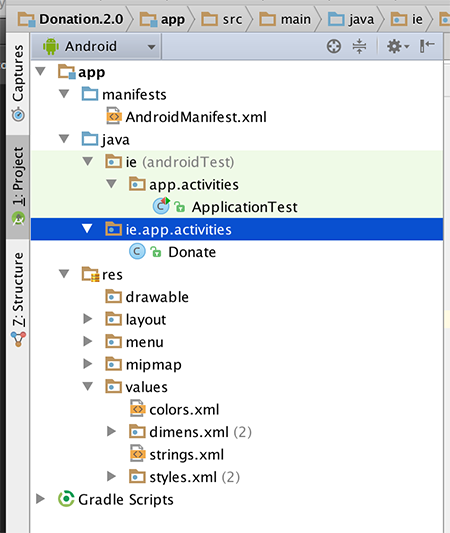

#Package Name

This is the current version of the <b>Donation</b> app:

- [Donation.1.5.zip](../archives/Donation.1.5.zip)

To continue using this project we need to 'refactor' it to <b>Donation.2.0</b>. At the time of writing, Android Studio's refactoring features and tools are a bit iffy :-) so we'll need to manually copy our project.

1. Ensure you don't have <b>Donation.1.5</b> open in Android Studio - if you do, close it now
2. Navigate to the folder where you downloaded and unzipped <b>Donation.1.5</b>
3. Rename (or copy if you wish) the folder to <b>Donation.2.0</b>
4. Rename the file <b>Donation.1.5.iml</b> to <b><i>Donation.2.0.iml</i></b>
5. Edit <b><i>Donation.2.0.iml</i></b> and change any references to <b>Donation.1.5</b> to <b>Donation.2.0</b>
6. Navigate to the <b>.idea</b> folder (it might be a hidden folder) open the <b>.name</b> file and rename the project name to <b>Donation.2.0</b>
7. Launch Android Studio and open up the <b>Donation.2.0</b> project

We should also take this opportunity to change the name of the 'ie.app' package to 'ie.app.activities', as we will be introducing other packages later on.

So create a new Package (in the 'main' folder)

and drag in your <b>Donate.java</b> into this new package. You can delete the empty package (if Android Studio hasn't done it already)

Do the same for the <b>ApplicationTest</b> class.

Next, check that the import statement in Donate.java is as follows:
~~~java
import android.widget.Toast;

import ie.app.R;

public class Donate extends AppCompatActivity
~~~

So make sure your project structure looks like the above before continuing.

Also, don't forget to change the <b>app_name</b> string resource in your strings.xml.

You should 'Clean' your project at this stage "Build->Clean Project", and then Rebuild & finally run your app, to make sure everything is ok.

