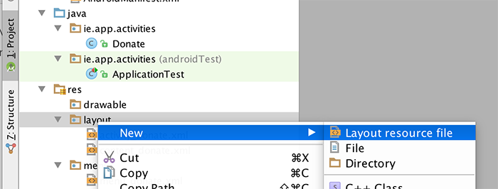
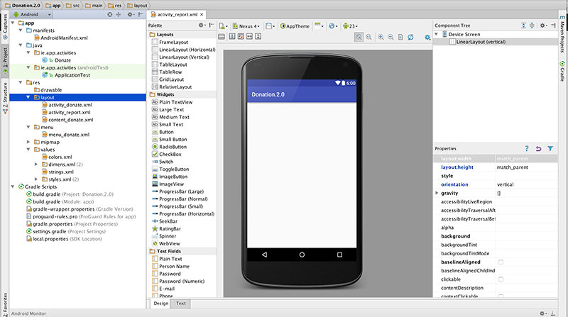

#Reports Activity

Before we start to design a new activity, Add a string resource in res/values/strings.xml:

~~~xml
<string name="reportTitle">Report</string>
~~~

Design a new layout called <b>activity_report</b>. Do this by locating the res/layout folder and selecting new->layout resource file:

You can choose all the defaults for this layout.

'Morph' our layout from Linear to Relative, like so,

and build a layout similar to the following:

This is the layout file itself:

~~~xml
<?xml version="1.0" encoding="utf-8"?>
<RelativeLayout xmlns:android="http://schemas.android.com/apk/res/android"
    android:orientation="vertical" android:layout_width="match_parent"
    android:layout_height="match_parent">

    <TextView
        android:layout_width="wrap_content"
        android:layout_height="wrap_content"
        android:textAppearance="?android:attr/textAppearanceLarge"
        android:text="@string/reportTitle"
        android:id="@+id/reportTitle"
        android:layout_marginLeft="0dp"
        android:layout_marginTop="31dp"
        android:layout_alignParentTop="true"
        android:layout_alignParentStart="true"
        android:layout_alignParentEnd="true" />

    <ListView
        android:layout_width="wrap_content"
        android:layout_height="wrap_content"
        android:id="@+id/reportList"
        android:layout_below="@+id/reportTitle"
        android:layout_alignParentStart="true" />
</RelativeLayout>
~~~

Introduce a new Class into app.activities to render this activity:

~~~java
package app.activities;

import app.donation.R;
import app.main.DonationApp;
import android.app.Activity;
import android.os.Bundle;
import android.widget.ArrayAdapter;
import android.widget.ListView;

public class Report extends Activity
{
  ListView listView;
  
  static final String[] numbers = new String[] { 
      "Amount, Pay method",
      "10,     Direct",
      "100,    PayPal",
      "1000,   Direct",
      "10,     PayPal",
      "5000,   PayPal"};
 
  @Override
  public void onCreate(Bundle savedInstanceState) 
  {
    super.onCreate(savedInstanceState);
    setContentView(R.layout.activity_report);
 
    listView = (ListView) findViewById(R.id.reportList);
    ArrayAdapter<String> adapter = new ArrayAdapter<String>(this,  android.R.layout.simple_list_item_1, numbers); 
    listView.setAdapter(adapter);
  }
} 
~~~

This will display a hard-coded lists of donations.

Change Donation activity to load this view when 'Report' selected from menu:

~~~java
  @Override
  public boolean onOptionsItemSelected(MenuItem item)
  {
    switch (item.getItemId())
    {
      case R.id.menuReport : startActivity (new Intent(this, Report.class));
                             break;
    }
    return true;
  }
~~~

All of this will not work until you add the activity specification to the AndroidManifest.xml file:

~~~xml
        <activity
            android:name="app.activities.Report"
            android:label="@string/donateTitle" >
        </activity>
~~~

Try it all now - it should load.