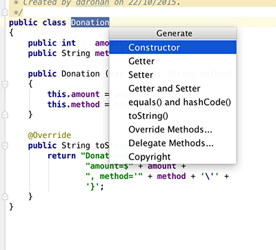

#Exercise & Solution

As a final exercise, try and add some event handling to the Report Activity - i.e. when the user selects a row in Report List, display a simple toast detailing which row was selected and the donation data from that row.

Something like this:

You may find the following useful if you need to refactor your Donation model

and

Project Solution (and Starter for the next lab):

- [Donation.4.0.Starter](../archives/Donation.4.0.Starter.zip)

