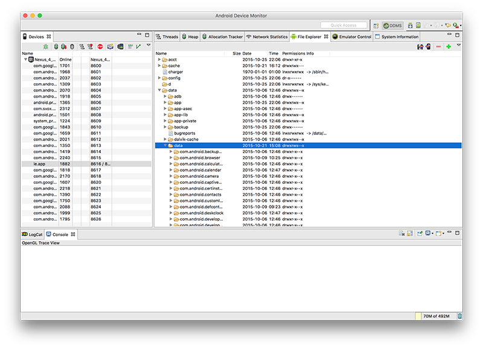

# Android Device Monitor

As an exercise of sorts, you should become familar with the Android Device Monitor, particularly how it relates to viewing your database on the emulator/device. 

---

In Android Studio, you launch the Android Device Monitor as follows:

Tools->Android->Android Device Monitor (as below)

Next, you need to navigate to the data/data folder within the application package (in our case ie.app) like so:

