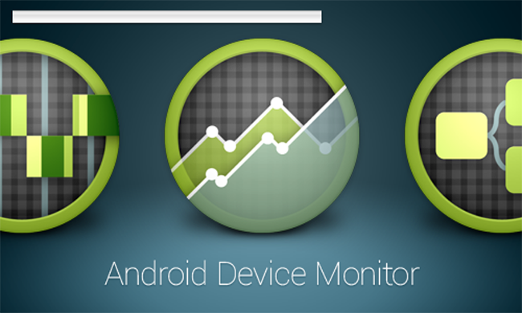
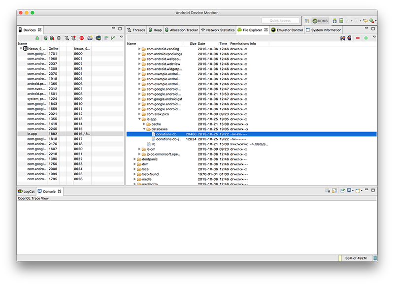
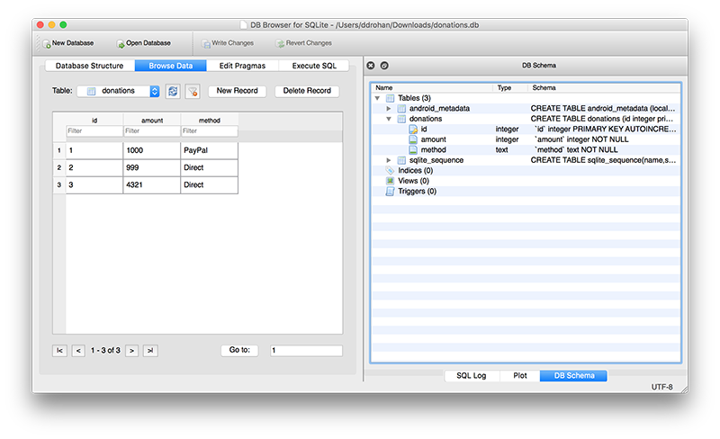

# Android Device Monitor

As an exercise of sorts, you should become familar with the Android Device Monitor, particularly how it relates to viewing your database on the emulator/device. 

---

In Android Studio, you launch the Android Device Monitor as follows:

Tools->Android->Android Device Monitor (as below)

Next, you need to navigate to the data/data folder within the application package on the device (in our case ie.app) like so:

Then, scroll/find your database (donations.db) in the ie.app.databases folder:

Select the "Pull a file from the Device" on the top right-hand-side of the window:

and save your database file to a local folder.

Next download and install [sqlitebrowser](http://sqlitebrowser.org) which will allow us to view our database graphically.

Launch your sqlitebrowser app/program to get this window:

and then 'Open Database' selecting the database you pulled from the device.

