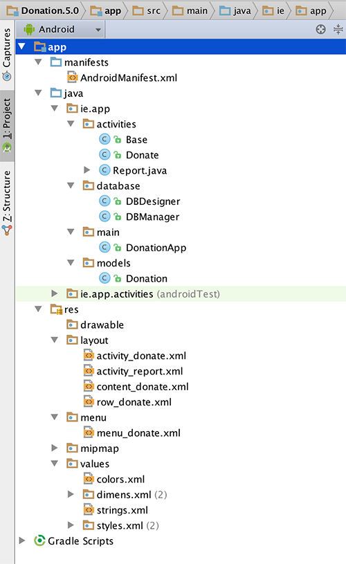

#Setup - Starter Code

As with the previous labs, you can download the solution/starter code for [Donation.5.0.starter](../archives/Donation.5.0.Starter.zip), or continue on with your own version.

Your current project (after renaming/copying) should looks as follows:

In this lab, you are required to do the following:

- Add REST Support via the [Donation sister site](http://donationweb-4-0.herokuapp.com) 
- Remove the Database Support and revert to the original Donation List
- Refactor existing Classes to accommodate the new REST API

The following steps will guide you through these requirements, so we'll start with bringing in the classes we need to connect to our Web Service.