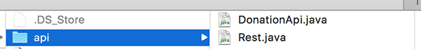
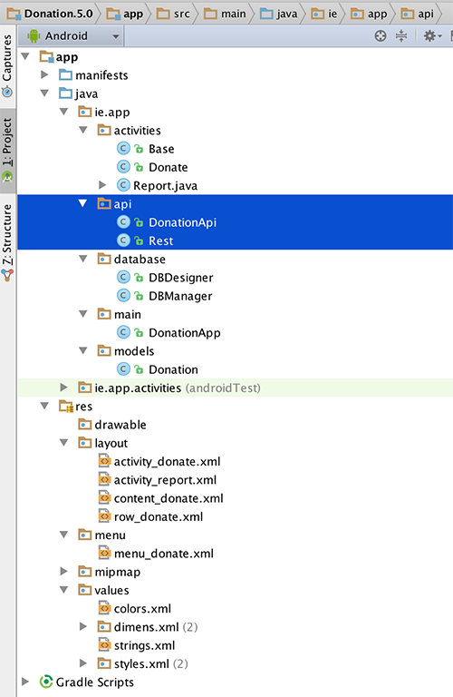
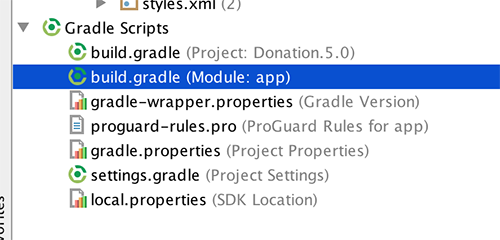
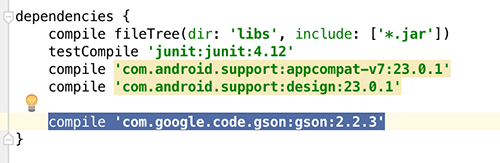

# Adding REST Support

The main purpose of this version of Donation is to connect to a Web Service ([our sister site](http://donationweb-4-0.herokuapp.com)) and be able to retrieve, insert and delete Donations.

To make things a bit easier I've devloped a simple API to make the HTTP calls and convert the responses from JSON into objects our Android App can use.

So go ahead and download the package [here](../archives/api.zip).

The extracted archive consists of the following:

* DonationApi.java
* Rest.java

You will need to add these classes to your Android Studio Project and the simplest way is to copy the api folder in Windows Explorer or Finder and paste directly into your <b>ie.app</b> package in your Android Studio Project. Once completed, your project should look something like this:

Now, if you Rebuild the project

Build->Rebuild Project

you'll have a number of errors relating to [Googles Gson](https://sites.google.com/site/gson/gson-user-guide), so first thing to do is add <b> Googles Gson's</b> dependency to our project:

- Open your 'build.gradle' file for <b>app</b>, <b>NOT THE PROJECT!</b>

- Add the Gson dependency

~~~xml
compile 'com.google.code.gson:gson:2.2.3'
~~~

so your dependencies in your build file looks something like this

Rebuild your project again and you should now be error free!

