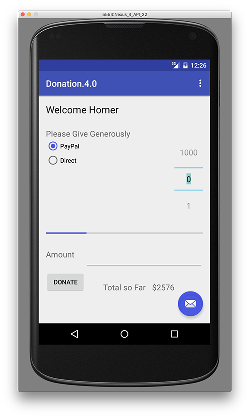

# Refactoring our Donation Model

If you've payed particular attention to the JSON string that was returned in the previous request, you'll see that there are 4 attributes, of different types - which don't match our current <b>Donation</b> class.

This is why the app crashed - we were trying to convert our json string into a list of objects that are not the same type.

So go ahead and replace your current Donation Model with this one

~~~java
public class Donation
{
    public String _id;
    public int    amount;
    public String paymenttype;
    public int    upvotes;

    public Donation (int amount, String method, int upvotes)
    {
        this.amount = amount;
        this.paymenttype = method;
        this.upvotes = upvotes;
    }

    public Donation ()
    {
        this.amount = 0;
        this.paymenttype = "";
        this.upvotes = 0;
    }

    public String toString()
    {
        return _id + ", " + amount + ", " + paymenttype + ", " + upvotes;
    }
}
~~~

There'll be a few small errors to fix, but once you do, run your app again and you should get something like the following:

