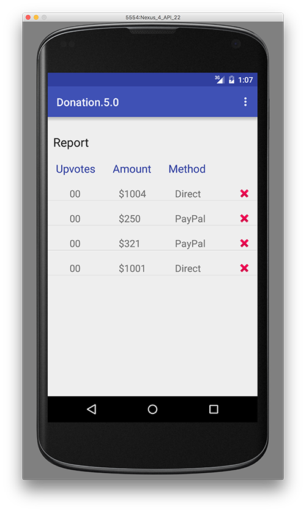

# Report Activity - Displaying our Donations

Here's the updated custom layout you should have (or something similar)

~~~xml
<?xml version="1.0" encoding="utf-8"?>
<LinearLayout xmlns:android="http://schemas.android.com/apk/res/android"
    android:orientation="horizontal" android:layout_width="fill_parent"
    android:layout_height="match_parent">

    <TextView
        android:id="@+id/row_upvotes"
        android:layout_width="80dp"
        android:layout_height="wrap_content"
        android:layout_marginStart="40dp"
        android:layout_marginTop="20dp"
        android:text="@string/defaultAmount"
        android:textSize="18sp" />

    <TextView
        android:id="@+id/row_amount"
        android:layout_width="80dp"
        android:layout_height="wrap_content"
        android:layout_marginTop="20dp"
        android:layout_marginLeft="10dp"
        android:text="@string/defaultAmount"
        android:layout_weight="1"
        android:textSize="18sp" />

    <TextView
        android:id="@+id/row_method"
        android:layout_width="80dp"
        android:layout_height="wrap_content"
        android:layout_marginTop="20dp"

        android:text="@string/defaultMethod"
        android:layout_weight="1"
        android:textSize="18sp" />

    <ImageView
        android:id="@+id/imgDelete"
        android:layout_width="25dp"
        android:layout_height="25dp"
        android:layout_marginTop="20dp"
        android:layout_weight="1"
        android:src="@android:drawable/ic_delete" />

</LinearLayout>
~~~

Now, if you run the app again, and select the Report Menu Option, you'll actually see the list that has been retrieved from the server - with no extra coding - how is this possible?

Experiment with the Swipe Refresh gesture and see what happens?
