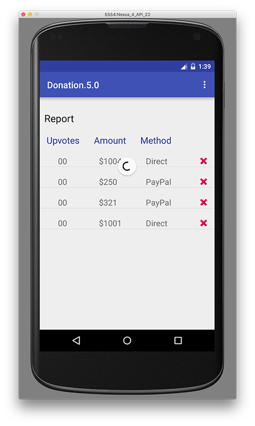

# Report Activity - Implementing Swipe Refresh

You've probably noticed that even though we can 'refresh' our report list, all we see is the refresh progress spin indefinitely - we've no way to stop it except closing the activity.

The reason being, we have no backend implementation of the gesture to actually refresh the data in the list - so let's do that.

The first thing we need to do is introduce a new AsyncTask to retrieve the donations - more advanced approaches could utilise interfaces and inheritance to reuse already existing AsyncTasks (like our GetAllTask), but for the moment, we'll try and keep it as simple as possible and write a new GetAllTask specifically for the Report activity.

Add the below AsyncTask to the Report Activity;

~~~java
private class GetAllTask extends AsyncTask<String, Void, List<Donation>> {

        protected ProgressDialog dialog;
        protected Context context;

        public GetAllTask(Context context) {
            this.context = context;
        }

        @Override
        protected void onPreExecute() {
            super.onPreExecute();
            this.dialog = new ProgressDialog(context, 1);
            this.dialog.setMessage("Retrieving Donations List");
            this.dialog.show();
        }

        @Override
        protected List<Donation> doInBackground(String... params) {

            try {
                return (List<Donation>) DonationApi.getAll((String) params[0]);
            } catch (Exception e) {
                Log.v("ASYNC", "ERROR : " + e);
                e.printStackTrace();
            }
            return null;
        }

        @Override
        protected void onPostExecute(List<Donation> result) {
            super.onPostExecute(result);

            app.donations = result;
            adapter = new DonationAdapter(context, app.donations);
            listView.setAdapter(adapter);
            listView.setOnItemClickListener(Report.this);
            mSwipeRefreshLayout.setRefreshing(false);

            if (dialog.isShowing())
                dialog.dismiss();
        }
    }
~~~

Fix all the errors (bar 1) and then bring in the following reference

~~~java
SwipeRefreshLayout mSwipeRefreshLayout;
~~~

replace the existing onCreate() method with this one

~~~java
@Override
    public void onCreate(Bundle savedInstanceState) {
        super.onCreate(savedInstanceState);
        setContentView(R.layout.activity_report);

        listView = (ListView) findViewById(R.id.reportList);
        mSwipeRefreshLayout = (SwipeRefreshLayout) findViewById(R.id.report_swipe_refresh_layout);

        new GetAllTask(this).execute("/donations");

        mSwipeRefreshLayout.setOnRefreshListener(new SwipeRefreshLayout.OnRefreshListener() {
            @Override
            public void onRefresh() {
                new GetAllTask(Report.this).execute("/donations");
            }
        });
    }
~~~

Run your app again and confirm that the refresh is working correctly, by adding or deleting a donation on the Web and then refreshing your Report Screen.

## <b>Note : as everyone and anyone :-) can add and/or delete donations via the web app, I'd encourage you to keep the list of donations to 4 or 5 while you're testing</b>

We should also be displaying the 'upvotes' values for each donation so replace your current DonationAdapter with this one, and run and test your app again, to complete this step.

~~~java
class DonationAdapter extends ArrayAdapter<Donation> {
    private Context context;
    public List<Donation> donations;

    public DonationAdapter(Context context, List<Donation> donations) {
        super(context, R.layout.row_donate, donations);
        this.context = context;
        this.donations = donations;
    }

    @Override
    public View getView(int position, View convertView, ViewGroup parent) {
        LayoutInflater inflater = (LayoutInflater) context
                .getSystemService(Context.LAYOUT_INFLATER_SERVICE);

        View view = inflater.inflate(R.layout.row_donate, parent, false);
        Donation donation = donations.get(position);

        TextView amountView = (TextView) view.findViewById(R.id.row_amount);
        TextView methodView = (TextView) view.findViewById(R.id.row_method);
        TextView upvotesView = (TextView) view.findViewById(R.id.row_upvotes);

        amountView.setText("" + donation.amount);
        methodView.setText(donation.paymenttype);
        upvotesView.setText("" + donation.upvotes);

        view.setTag(donation._id); // setting the 'row' id to the id of the donation

        return view;
    }

    @Override
    public int getCount() {
        return donations.size();
    }
}

~~~
