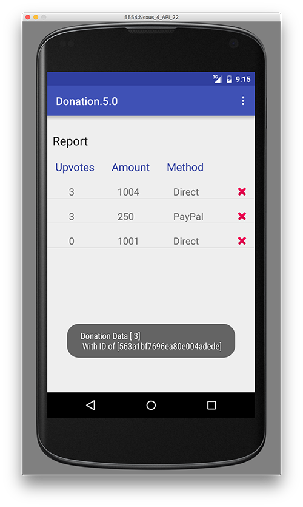

# Report Activity - Event Handling

Here's the solution to our updated DonationAdapter class so replace your current DonationAdapter with this one, and run and test your app again, to complete the step.

~~~java
class DonationAdapter extends ArrayAdapter<Donation> {
    private Context context;
    public List<Donation> donations;

    public DonationAdapter(Context context, List<Donation> donations) {
        super(context, R.layout.row_donate, donations);
        this.context = context;
        this.donations = donations;
    }

    @Override
    public View getView(int position, View convertView, ViewGroup parent) {
        LayoutInflater inflater = (LayoutInflater) context
                .getSystemService(Context.LAYOUT_INFLATER_SERVICE);

        View view = inflater.inflate(R.layout.row_donate, parent, false);
        Donation donation = donations.get(position);

        TextView amountView = (TextView) view.findViewById(R.id.row_amount);
        TextView methodView = (TextView) view.findViewById(R.id.row_method);
        TextView upvotesView = (TextView) view.findViewById(R.id.row_upvotes);

        amountView.setText("" + donation.amount);
        methodView.setText(donation.paymenttype);
        upvotesView.setText("" + donation.upvotes);

        view.setTag(donation._id); // setting the 'row' id to the id of the donation

        return view;
    }

    @Override
    public int getCount() {
        return donations.size();
    }
}
~~~

While we working on the Report Activity, let's add some event handling so we can 

* view the details of an individual Donation and
* delete a specific Donation via the delete Button

Introduce this AsyncTask into the Report Activity

~~~java
private class GetTask extends AsyncTask<String, Void, Donation> {

        protected ProgressDialog dialog;
        protected Context context;

        public GetTask(Context context) {
            this.context = context;
        }

        @Override
        protected void onPreExecute() {
            super.onPreExecute();
            this.dialog = new ProgressDialog(context, 1);
            this.dialog.setMessage("Retrieving Donation Details");
            this.dialog.show();
        }

        @Override
        protected Donation doInBackground(String... params) {

            try {
                return (Donation) DonationApi.get((String) params[0], (String) params[1]);
            } catch (Exception e) {
                Log.v("donate", "ERROR : " + e);
                e.printStackTrace();
            }
            return null;
        }

        @Override
        protected void onPostExecute(Donation result) {
            super.onPostExecute(result);

            Donation donation = result;

            Toast.makeText(Report.this, "Donation Data [ " + donation.upvotes + "]\n " +
                    "With ID of [" + donation._id + "]", Toast.LENGTH_LONG).show();

            if (dialog.isShowing())
                dialog.dismiss();
        }
    }
~~~

Fix any errors, and see can you add an <b>OnItemClickListener</b> to our Report class to display the Toast (below) when a row is selected, by invoking the above AsyncTask.

To implement the delete feature, we need to implement an <b>OnClickListener</b> interface so go ahead and do that and bring in this AsyncTask to begin with.

~~~java

~~~

and also this method

~~~java

~~~